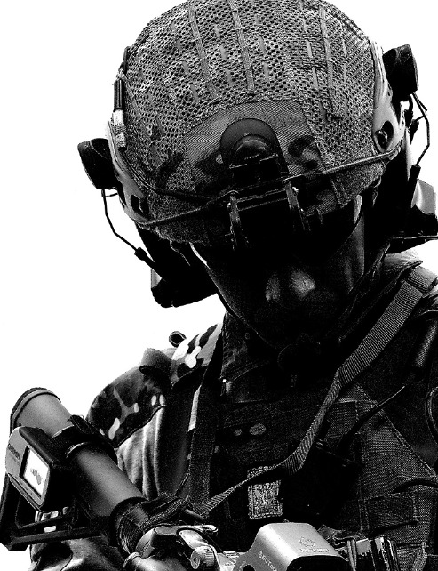
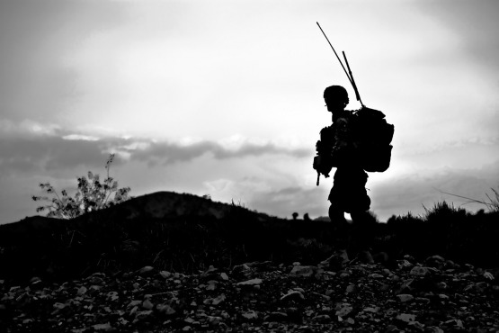
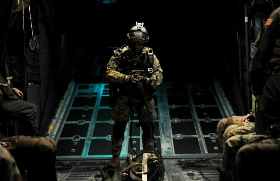
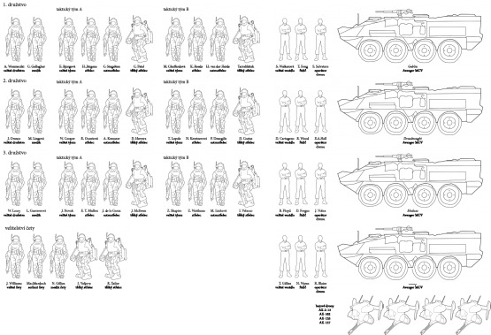

Struktura fiktivní čety námořní pěchoty, kterou můžete použít ve svých hrách a příbězích z prostředí sci-fi / space opery.

V tomto článku jsem se pokusil nastínit strukturu bojové jednotky fiktivní námořní pěchoty, která by mohla fungovat v blízké budoucnosti (podobné například filmu Aliens), kdy lidstvo osídlilo cizí planety, začíná s jejich terraformací a dochází k válkám a bitvám na cizích planetách. Přesto se stále pohybujeme v rámci představitelného – přes všechny vynálezy a změny v budoucnosti je hlavní bojovou silou stále voják s puškou, který musí vybojovat bitvy. A od toho je tu námořní pěchota (které se tak říká, přestože už dávno nepůsobí na moři, ale mezi hvězdami), jež je nasazována k „vykopání těch zlých“ odkudkoli, kde se tito nacházejí. V článku je představena mechanizovaná četa složená ze tří střeleckých družstev, vybavená čtyřmi obrněnými transportéry, čtveřicí útočných a čtveřicí průzkumných dronů. Jednotku můžete prostě vzít a použít, pokud budete potřebovat, aby se někde nějaký vojenský oddíl objevil, ale nebudete ho chtít vymýšlet.

__Zařazení oddílu:__

1. četa, rota C (Charlie), 2. prapor 92. pluku („Pohraniční rváči“)

__Velitel oddílu:__

poručík J. Williams (výraz­né rysy: _výkonný, pružně přemýšlející, sběratel metálů/ambiciózní_)

__Velitel roty C:__

kapitán E. Baldwine III. (výrazné rysy: _všechno podle příručky, přímo z důstojnické školy, nezkušený_)

__Velitel pluku:__

plukovník H. J. „Pirát“ Roberts (výrazné rysy: _agresivní, inspirující, nehledí na ztráty_)

I pouhá četa představuje na bojišti sílu, se kterou se musí počítat, a při správném nasazení dokáže způsobit opravdu hodně škody. Výhodami mechanizované pěchoty jsou především její vysoká mobilita a využívání kombinace skvěle vyzbrojených a vycvičených pěšáků a obrněných transportérů s těžkými zbraněmi. Četa má solidní palebnou sílu proti pěchotě a lehce pancéřovaným cílům (zbraně pěšáků, těžké kanony na transportérech a kulomety dronů), má ale také dostatek protitankových zbraní (za běžných okolností 14, v případě očekávání pancéřovaných cílů může střelec z každého týmu nést dodatečný protitankový raketomet a zvýšit počet zbraní na 20), aby dokázala zastavit útok obrněných transportérů, tanků nebo mimozemských tvorů chráněných pancířem.

První četa může být nasazena buď v rámci celé roty Charlie, nebo také samostatně k plnění určených cílů. V případě, že nastane opravdu velký průšvih, pak velitelství sebere všechny dostupné jednotky, které jsou po ruce v dané oblasti. Pak by první četa bojovala po boku mužů z různých jednotek a pluků. Četa má k dispozici výsadkovou loď třídy X2, která dokáže přenést všechny její stroje a vojáky z oběžné dráhy na bojiště (případně mezi různými místy na planetě). Ve chvíli, kdy pronikne do atmosféry (nebo do blízkosti cílové oblasti), vypustí výsadková loď několik rojů malých dronů, které zamíří k nebezpečné oblasti jako první. Roje dronů zahltí protiletadlovou obranu a obrazovky obranných počítačů (mnohé navíc vysílají signály, vystřelují magneziové světlice, manévrují a na radaru je obtížné je odlišit od normálního cíle), napadnou postavení protiletadlové obrany (část z nich je vybavena výbušnými hlavicemi a řízeným pádem mohou zničit nepřátelské postavení) a provedou prvotní průzkum oblasti (poskytnou pilotovi lodě a veliteli informace o oblasti výsadku a místě přistání).

Výsadková loď pak dosedne v bezpečné oblasti v blízkosti cíle, ale mimo předpokládanou palbu nepřítele. V co nejkratší možné době vylodí všechny čtyři transportéry s naloženými družstvy a pak zase vzlétne, aby se stáhla mimo nebezpečnou oblast, připravena četu opět vyzvednout, až bude zapotřebí.

# Struktura čety

Součástí čety je jeden důstojník, virtuální inteligence a 46 vojáků rozdělených do tří sekcí – velitelství čety, samotná střelecká družstva a obrněné transportéry.

## Velitelství čety

Sestává se z velitele čety, seržanta čety, virtuální inteligence ORCA, medika čety a dvojice granátníků.

__Velitel čety:__ poručík J. Williams, výrazné rysy: _výkonný, pružný, sběratel metálů / ambiciózní _– Velitel s hodností poručíka je zodpovědný za četu a její činnost v boji i mimo něj. S pomocí virtuální inteligence má na velícím stanovišti k dispozici satelitní mapy, záběry z  dronů a přenosy z kamer, které vojáci nesou na přilbách, může se tak snadno orientovat v situaci na bojišti.

__Seržant čety:__ štábní seržant MacMurdoch, výrazné rysy: _křestní jméno „Seržant“, veterán tuctů bitev, nebere si servítky_ – Seržant čety je druhým v řetězci velení, asistuje a radí veliteli a v případě nepřítomnosti nebo úmrtí velitele přebírá velení čety. V případě, že četa vystoupí z transportérů, často vede muže přímo v boji, zatímco poručík zůstává na velitelském stanovišti (v případě, že naopak poručík vede vojáky přímo, zůstává na velitelském stanovišti, aby velel transportérům).

__Virtuální inteligence ORCA__ – ORCA je program, který slouží veliteli jako pomocník a komunikační operátor. Nejde o umělou inteligenci v pravém slova smyslu (ORCA si neuvědomuje sama sebe, jakkoli mnozí velitelé přísahají, že jejich ORCA si vytvořila charakter), ale o soustavu programů, které jsou spojeny tak, aby vytvářely jediný nástroj. Má sloužit k rychlému vyhodnocování rizik, informování velitele o změnách situace na bojišti, vykonávání rutinních úkolů, předávání rozkazů velení, kontrole zdravotního stavu všech vojáků a okolního prostředí (teplota, radiace, kyslík), hlídání zásob munice, paliva a energie, zjišťování informací o situaci v okolních sektorech a spravování komunikace, aby místo řešení těchto věcí poskytla veliteli prostor k řešení problémů, které před ním stojí v bitvě. V případě vysednutí z transportérů může velitel čety s virtuální inteligencí dál komunikovat a interagovat skrze osobní počítač na paži a komunikační kanál určený pouze k tomuto účelu.

__Medik čety__ – Medik čety má na starosti stabilizaci mužů, kteří byli zraněni v boji, do doby, než je možné je evakuovat do zázemí. Není to doktor a nemá vzdělání ani schopnosti, aby prováděl složité operace (jeho úkolem je udržet vojáky naživu, než se dostanou do zázemí), ale v případě, že je četa osamocena, musí často provádět základní válečnou chirurgii. V případě, že je to možné, vytvoří na bojišti centrální obvaziště, kam jsou odnášeni zranění z bitevní čáry, a s pomocí mediků jednotlivých družstev se je snaží udržet při životě.

Dvojice __granátníků__ – Jsou vybaveni těžkým mechanickým exoskeletem, díky kterému mohou nést najednou kulomet a protitankovou zbraň, stejně jako náhradní munici pro zbytek týmu. V případě, že obleku dojde energie, granátníci ho odhodí a fungují dál bez něj (vezmou si pak jen jednu z podpůrných zbraní). Oba slouží jako doprovod velitele čety (případně seržanta) a mají za úkol udržet ho naživu a dát mu příležitost pro řízení bitvy.

## 3 střelecká družstva

Každé ze tří střeleckých družstev je tvořeno velitelem družstva, medikem a osmi dalšími vojáky. Ti jsou rozděleni do dvou čtyřčlenných _taktických týmů_, složených vždy z velitele týmu, střelce, granátníka a ostrostřelce (každý taktický tým se dále dělí na dvě dvojice, které se vzájemně kryjí a postupují společně).

__Velitel družstva:__ seržanti A. Woznieczki (výrazný rys: _horkokrevý a zbrklý_), J. Orosco (výrazný rys: _pocuchané nervy_) a W. Lacey (výrazný rys: _jeho muži ho budou následovat až do pekel a zpátky_) – Dle rozkazů velitele čety velí družstvu. Vydává rozkazy desátníkům, kteří vedou oba taktické týmy, ze kterých se družstvo skládá.

__Medik družstva__ – Za normálních okolností funguje jako střelec, kdy kryje velitele družstva. V případě, že je některý ze spolubojovníků zraněn, dokáže rychle aplikovat základní první pomoc a krytý velitelem (nebo pověřeným vojákem, případně dvojicí) pak zajistit evakuaci zraněného za bitevní čáru.

__Taktický tým__

* __Velitel týmu__ – Má hodnost desátníka a vede taktický tým podle rozkazů nadřízeného seržanta.
* __Střelec__ – Zpravidla nejméně zkušený člen týmu (služebně nejmladší). Kryje velitele týmu, který na něj dává pozor, a slouží týmu zároveň jako průzkumník. V případě, že se očekává odpor pancéřovaných cílů, bere si z transportéru na misi ještě záložní protitankový raketomet.
* __Granátník__ – Je vybaven těžkým mechanickým exoskeletem, díky kterému může nést najednou kulomet a protitankovou zbraň, stejně jako náhradní munici pro zbytek týmu. V případě, že obleku dojde energie, granátník ho odhodí a funguje dál bez něj (vezme si pak jen jednu z podpůrných zbraní). Funguje také jako zástupce velitele týmu a vedoucí druhé dvojice.
* __Ostrostřelec__ – Má k dispozici dalekonosnou pušku s přesnou optikou, se kterou může vyřadit na delší vzdálenosti cíle vysoké bojové hodnoty, jako nepřátelské velitele, kulometníky, odstřelovače a vojáky s protitankovými zbraněmi.

# Technika

4 obrněné transportéry Avenger MCV (_Goblin, Dreadnought, Medusa a Lucky_)

Četa je vyzbrojena 4 obrněnými transportéry Avenger, které poskytují rychlou operační mobilitu pěchotním družstvům, aby se mohla přesunout na kritická místa bojiště, chráněna před pěchotní palbou. Tři transportéry jsou určeny pro střelecká družstva, jeden slouží jako mobilní velící stanoviště pro velitelství čety (je vybaven dodatečnou komunikační technikou, která umožňuje spojení s  velením). Ve chvíli, kdy se vozidlem přesouvá družstvo, je velitel družstva zároveň velitelem vozidla a vydává rozkazy jeho posádce (v případě velícího transportéru je velitelem vozidla seržant čety). Vozidlo dále veze zásoby munice, kyslíku, dodatečných zbraní pro celé družstvo (dodatečné protitankové raketomety pro pěšáky a obranné automatické kulomety, které je možné využít pro obranu a které je možné napojit na virtuální inteligenci ORCA) a slouží jako úkryt před nepříznivými podmínkami na planetách s nedýchatelnou nebo nepřátelskou atmosférou.

Obrněné transportéry Avenger jsou navržené tak, aby dokázaly operovat na většině známých světů (včetně světů s nízkou gravitací, nedýchatelnou atmosférou a velkým atmosférickým tlakem) a byly strategicky mobilní (schopné se rychle přepravovat na dlouhé vzdálenosti). Jako takové mají nižší pancéřovou ochranu než standardní vojenské transportéry Chimera, ale mají mnohem menší logistické nároky. Navzdory tomu se již několikrát prokázalo, že vozidla Avenger dokážou s podporou pěchoty vyzbrojené protitankovými zbraněmi vzdorovat i nepřátelským tankům a těžkým obrněným transportérům.

Každý transportér má posádku tří mužů, z toho dva se starají o řízení a provoz vozidla – řidič a velitel vozidla. Posádka transportéru zodpovídá za přesun příslušného družstva na určené místo, přičemž velitel využívá obrannou výzbroj vozidla (automatický kanon velké ráže) k podpoře pěchoty, ničení nepancéřovaných vozidel a pěchoty nepřítele. Transportér má také protitankové naváděné rakety, kterými může napadnout tanky a pancéřované cíle.

Posledním členem posádky transportéru je operátor dronu. Ten na svém stanovišti (počítačová konzole za řidičem a velitelem vozidla) řídí dron, který se za normálních okolností veze na střeše transportéru. V případě ohrožení jej vyšle do vzduchu, kde poskytuje veliteli informace o okolním bojišti. Sami operátoři jsou sice vyzbrojeni osobními zbraněmi, ale za normálních okolností zůstávají ve velitelském transportéru u svých terminálů a do boje zasahují pouze prostřednictvím svých strojů. Každý operátor má k dispozici malý průzkumný dron (drobných rozměrů, který slouží k průzkumu bojiště a může být v případě potřeby přímo řízen systémem ORCA) a větší útočný dron vyzbrojený kulometem a dvojicí neřízených raket. Ty pak poskytují přímou palebnou podporu každému z družstev (každý jednomu) a mohou rychle zasáhnout v případě nenadálého průlomu.

# Příklady misí

* Zajištění orbitální stanice / těžební základny / terraformační stanice / kolonie, která se odmlčela. Četa je považována za dostatečnou sílu, která by měla zjistit situaci na místě, vypořádat se s problémy (povstáním kolonistů, útokem nepřátel, pirátů, mimozemských organismů) a obnovit spojení.
* Obrana důležitého úseku linie – Četa může dostat za úkol udržet klíčové místo obrany. Pokud nepřítel prorazí, pak bude celá obrana ztracena a nepřátelé se dostanou do týlu ostatních jednotek. Četa tak musí vybudovat obranná postavení, položit miny a zátarasy (ale aby omezily možnosti jeho pohybu a navedly je do připravených palebných sektorů), rozmístit na kritická místa transportéry a protitankové zbraně a pak se zakopat a vyčkávat útoku nepřátelské přesily.
* Útok na nepřátelskou pozici – Četa mechanizované pěchoty je dostatečně vybavená, nejen aby se mohla bránit i proti útoku silnějších nepřátel, ale také aby dokázala zaútočit a prolomit nepřátelské linie. První četa může být stažena ze své bojové pozice a vyčleněna, aby se pokusila prorazit v kritickém úseku nepřátelských linií.
* Abordáž nepřátelské lodi s poškozenými motory – četa musí nechat své obrněné transportéry na vlastní lodi, obléknout se do těžkých skafandrů a jako pěchota se propálit skrze průchody nebo oslabení pancířů do nepřátelské lodi. Bitva na palubě neznámé lodi a v úzkých chodbách, které dokáže několik mužů bránit proti přesile, bývá často zmatenou a zuřivou záležitostí, kde se bojuje na několika patrech a úrovních najednou, útočníci se snaží prorazit přes obranné pozice a zatlačit obránce zpět, zatímco obránci lákají útočníky do předem připravených obranných pozic a léček. Nezřídka bitva skončí těžkými ztrátami na obou stranách.
* Průzkum neznámého místa (trosek mimozemské lodi uprostřed džungle, prastarého chrámu zapomenutého na nějakém měsíci, opuštěné základny, starého města, atp.), kde první četa má zajistit okolí a bezpečnost výzkumného týmu…. pro případ, že by existoval důvod, proč je zmíněné místo opuštěné; někdo je předběhl (a bylo třeba jej z místa nejprve vytlačit) nebo někdo dorazil až po nich, ale se stejným cílem.

---

